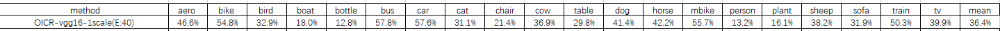

### OICR-pytorch

* [论文原址](http://xxx.itp.ac.cn/abs/1704.00138)
* 需创建文件夹region,放置ssw生成roi的[mat文件]
* 在项目文件夹父目录放置data文件夹，里面存放VOC2007数据

### 训练细节：
* 去除倒数第二个池化层，并将其后的卷积层改为dilated conv
* vgg16中没有的层bias初始化为0，weight根据标准差0.01，均值0的高斯分布初始化
* bs=4(即每四个backward进行一次step), 
* 不对bias做权重衰减，且bias的梯度乘于2，优化器为SGD(momentum=0.9)，lr初始设置为1e-4或1e-3
    * 论文配置采取 初始lr为 1e-3，28epoch后变为 1e-4，再训练12epoch(此为[pcl](https://github.com/ppengtang/pcl.pytorch)的训练参数)
    * 对于放缩图片尺寸较小的模型变体，全程采用lr=1e-4
* 不对ssw生成的roi做操作(包括去除过小的roi和去除重复的roi)，**做操作会影响模型的表现**
    * (本人理解)不同于[wsddn](http://xxx.itp.ac.cn/abs/1511.02853),此模型存在对具体roi的监督训练(虽然监督信息不是gt),去除部分roi会导致有意义的roi去除，导致oicr部分训练强度不足，达不到期望表现
    * 此为实验对比结果，当去除过小roi和重复roi后，模型最终表现只有20附近的mAP表现
    * 下面给出的是仅仅去除过小roi和不处理roi的实验结果(为了加快训练，此处对img的放缩仅放缩至较小scale)
* 对原始图片进行放缩+随机水平翻转的数据增强方法，放缩将最短边放缩到指定尺度，且保证最长边不超过2000
    * 超过2000则放缩图片至 (2000, x) (x为较短边放缩值的结果，放缩倍数为 2000/longest side)
    * 验证时对每张图片的2 * Scale张变体做处理然后取均值作为结果

### 模型表现
* Model_1 在scale=(480, )情况下，去除过小roi的设置下的模型表现(Lr=1e-4, Epoch：23)：

* Model_2 在scale=(480, 576, 688)情况下，去除过小roi的设置下的模型表现(Lr=1e-4, Epoch：26)：

* Model_3 在scale=(480, )情况下，不处理roi的设置下的模型表现(Lr=1e-4, Epoch：*)：

*等待更新*
* Model_4 在论文原配置下，不处理roi的设置下的模型表现()：

*等待更新*